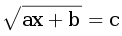

# D. Уравнение с корнем

| Ограничение времени | Ограничение времени | Ввод | Вывод |
| --- | --- | --- | --- |
| 1 секунда | 64Mb | стандартный ввод или input.txt | стандартный вывод или output.txt |

Решите в целых числах уравнение:\
\
a, b, c – данные целые числа: найдите все решения или сообщите, что решений в целых числах нет.

## Формат ввода
Вводятся три числа a, b и c по одному в строке.

## Формат вывода
Программа должна вывести все решения уравнения в порядке возрастания, либо NO SOLUTION (заглавными буквами), если решений нет. Если решений бесконечно много, вывести MANY SOLUTIONS.

### Пример 1
#### Ввод:
1\
0\
0
#### Вывод:
0

### Пример 2
#### Ввод:
1\
2\
3
#### Вывод:
7

### Пример 3
#### Ввод:
1\
2\
-3
#### Вывод:
NO SOLUTION